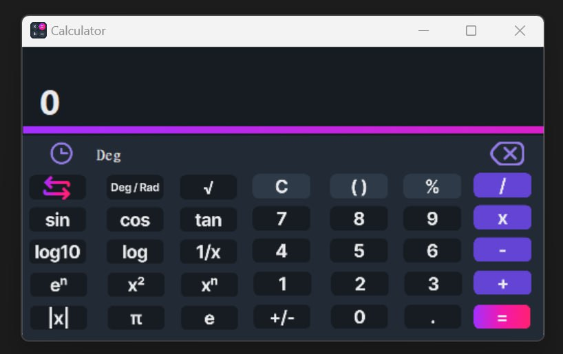

# Calculator

A feature-rich calculator built using C# and .NET Framework. This calculator provides basic arithmetic operations as well as advanced mathematical functions and handles the priority of operations (PEMDAS/BODMAS).

)


## Features

- **Basic Arithmetic Operations:** Addition, Subtraction, Multiplication, Division
- **Advanced Functions:** Sine, Cosine, Tangent, Logarithm, Exponential
- **Additional Utilities:** Square Root, Inverse, Power, Pi, Factorial, and more
- **Degree/Radian Mode** for Trigonometric Functions
- **Priority of Operations:** Handles operations according to PEMDAS/BODMAS rules
- **User-friendly Interface** with Dark Mode Theme

## Installation

1. **Clone the repository:**
   ```bash
   https://github.com/IsaacBh1/Calculator.git
   cd Calculator

